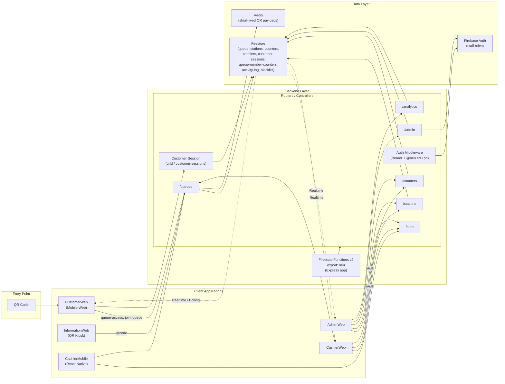

# New Era University Queue – High-Level Architecture

## Scope

- **Goal**: Define a high-level system architecture and main flows for the NEU Queue system based on the context in `Projects/New Era University Queue/Context/Context - New Era University Queue.md`.
- **Deliverables**: Component breakdown, data-flow description, and a Mermaid diagram expressing the main end-to-end flow.
- **Implementation**: This document reflects the actual `functions/` codebase (Express on Firebase Functions v2, Firestore, Redis).

## Core Components

### Client Applications

- **CustomerWeb (mobile-first web)**: Scans QR, exchanges QR for a customer session, enters email and purpose, selects station, joins queue, views live queue status.
- **AdminWeb**: Manages stations, counters, roles (Admin/Cashier/Information), blacklist, activity logs, and analytics.
- **CashierWeb**: For desktop browsers at cashier counters to serve customers and update queue state (enter/exit counter, start service, complete, mark no-show).
- **InformationWeb** (or kiosk): Generates short-lived QR codes for customers to scan; role `information` can access QR generation and auth.
- **CashierMobile** (optional/phase 2): React Native client consuming the same APIs for on-the-go serving.

### Backend (Node.js + Express on Firebase Functions v2)

The backend is a single Express app exported as **`neu`** (Firebase Functions v2 HTTP). It mounts CORS (allowed origins: Vercel frontends), JSON body parsing, and connects to **Redis** at startup.

- **Auth (middleware + user controller)**  
  - **Staff**: Bearer ID token in `Authorization` header. Firebase Auth validates token; domain restricted to **@neu.edu.ph** (non-NEU users are disabled). Custom claims hold **role**; new users get `pending` until an admin assigns a role.  
  - **Roles**: `superAdmin`, `admin`, `cashier`, `information`, `pending`.  
  - **Endpoints**: `GET /auth/admin/me`, `GET /auth/cashier/me`, `GET /auth/information/me` return current user profile (cashier includes `stationId` from Firestore `cashiers`).
- **Customer session (middleware)**  
  - Customers do **not** use Firebase Auth. Flow: scan QR → backend validates short-lived QR payload in **Redis** → creates/returns a **Firestore customer-session** (session doc id = `qrId` used in subsequent requests). Session has `type` (`form` | `queue` | `completed`), `expiresAt` (e.g. 8 hours), and `used`. Middleware `verifyCustomerSession("form")` or `verifyCustomerSession("queue")` ensures valid, non-expired, non-used session and matching type.
- **Queue (queue controllers)**  
  - **QR generation**: `GET /queues/qrcode` (auth + role cashier/admin/superAdmin/information) → creates short-lived payload in Redis (e.g. 5 min), returns `qrCodeDataUrl` and `qrId`.  
  - **Queue access**: `GET /queues/queue-access?initialQrId=...` (public) → validates Redis payload, creates Firestore `customer-sessions` doc, returns `path` (form or queue) and `sessionId`.  
  - **Stations for customer**: `GET /queues/available-stations?purpose=...` (customer session `form`) → returns stations whose `type` matches purpose and that have at least one counter with an active cashier (`cashierUid` set); each station includes `estimatedWaitTime`.  
  - **Join queue**: `POST /queues/join` (customer session `form`; body: email, purpose, stationId, qrId) → validates station type vs purpose, no duplicate email in queue for that station, updates customer-session to `queue`, assigns position and **queue number** from per-station sequence (`queue-number-counters`), computes `estimatedWaitTime`, writes to `queue` collection.  
  - **Get my queue**: `GET /queues/queue?qrId=...` (customer session `queue`).  
  - **Cashier/Admin**: `GET /queues/station/:stationId`, `GET /queues/counter/:counterId`, `GET /queues/counter/:counterId/current-serving`, `POST /queues/:queueId/start-service` (body: counterId), `POST /queues/:queueId/complete`, `POST /queues/:queueId/mark-no-show`; customer can `POST /queues/:queueId/cancel` (customer session `queue`, body: reason).  
  - **Estimated wait time**: Computed from recent completed services (avg service time), position, and number of active counters; refreshed after complete/cancel/no-show for remaining waiting/serving entries at the station.
- **Station (station controllers)**  
  - CRUD: `POST/GET /stations`, `GET/PUT/DELETE /stations/:stationId`. Stations have `name`, `description`, `type` (purpose: payment | clinic | auditing | registrar). Unique station name. Cashier: `GET /stations/assigned` returns their assigned `stationId` from `cashiers` collection.
- **Counter (counter controllers)**  
  - CRUD: `POST/GET /counters`, `GET /counters/:stationId`, `PUT/DELETE /counters/:counterId`. Counters have `number`, `stationId`, `cashierUid` (set when cashier enters). Cashier: `POST /counters/assigned` (body: uid), `POST /counters/:counterId/enter`, `POST /counters/:counterId/exit`; exit is blocked if any queue entries in that station are still waiting/serving.
- **Admin (admin controller)**  
  - Users: `GET /admin/pending-users`, `GET /admin/employees` (paginated), `POST /admin/assign-role`, `POST /admin/assign-cashier`, `POST /admin/unassign-cashier`, `GET /admin/users/:userId`, `GET /admin/available-cashiers`, `GET /admin/stations/:stationId/cashiers`.  
  - Activity: `GET /admin/activity-logs?startDate=&endDate=`.  
  - Blacklist: `GET/POST /admin/blacklist`, `DELETE /admin/blacklist/:email`.  
  - All under `verifyAuthTokenAndDomain` and `verifyRole(["admin", "superAdmin"])`.
- **Analytics (analytics controller)**  
  - `GET /analytics/average-wait-time` (optional `startDate`, `endDate`) → per-station average actual wait time (createdAt → servedAt).  
  - `GET /analytics/completed-throughput` (required `startDate`, `endDate`) → per-station count of completed services in date range.  
  - Access: admin, superAdmin.
- **Notification utilities**  
  - `sendNotification` (FCM) and `sendEmail` (nodemailer) exist in `utils/` but are **not** invoked from queue flow yet (e.g. “5th in line” or “now being served” notifications are planned, not implemented).
- **Request validation**  
  - Zod schemas validate bodies for join-queue, start-service, complete, cancel, station, counter, assign-role, assign-cashier, block-email.

### Data Layer

- **Firestore**
  - `stations`: `{ name, description, type, createdAt, updatedAt }` — `type` is one of: payment | clinic | auditing | registrar.
  - `counters`: `{ number, stationId, cashierUid?, createdAt, updatedAt }`.
  - `queue`: queue entries `{ stationId, counterId?, customerEmail, queueNumber, purpose, status, position, estimatedWaitTime?, qrId?, createdAt, servedAt?, servedBy?, completedAt?, cancelledAt?, cancelledBy?, reason? }` — `status`: waiting | serving | completed | cancelled | no_show; `purpose`: payment | clinic | auditing | registrar.
  - `cashiers`: `{ uid, email, displayName, stationId?, createdAt, updatedAt }` — staff with role cashier; assignment to station/counter tracked here.
  - `queue-number-counters`: per-station doc `{ lastNumber }` for generating queue numbers (e.g. PAY-001, CLI-001).
  - `customer-sessions`: `{ type (form|queue|completed), issuedAt, expiresAt, used?, status? }` — created when customer exchanges QR for session; `qrId` in API is this doc id.
  - `activity-log`: `{ uid, action, timestamp, details? }` — audit log for admin/counter/station/role/blacklist actions.
  - `blacklist`: `{ email, reason, blockedAt, blockedBy }`.
- **Redis**
  - Short-lived key-value store for QR payloads: key = `qrId` (UUID), value = JSON `{ type, expiresAt, createdBy }`, TTL e.g. 5 minutes. Used by `getQueueAccess` and QR generation.
- **Firebase**
  - **Auth**: Staff identities and custom claims (`role`).  
  - **Cloud Messaging (FCM)**: Available for `sendNotification`; device tokens / subscriptions would be stored elsewhere when notification flow is implemented.

## High-Level Flow Description

### Customer Flow

- Customer scans a **QR code** (generated by cashier/information/admin via `GET /queues/qrcode`) → opens **CustomerWeb** with `qr_id` in URL.
- CustomerWeb calls **`GET /queues/queue-access?initialQrId=...`** (public). Backend validates Redis QR payload and creates a Firestore **customer-session**; returns `path` (e.g. `/form`) and **sessionId** (used as `qrId` in later requests).
- Customer enters **email** and selects **purpose**. CustomerWeb calls **`GET /queues/available-stations?purpose=...`** with `qrId` (session id); backend returns stations of that type with at least one active counter, each with **estimatedWaitTime**.
- Customer selects a station. CustomerWeb calls **`POST /queues/join`** with email, purpose, stationId, qrId. Backend: validates station type, no duplicate email in queue, updates customer-session to `queue`, assigns position and **queue number** (per-station sequence, e.g. PAY-001), computes **estimatedWaitTime**, writes to `queue` collection. Returns queueNumber, position, estimatedWaitTime.
- Customer sees a **live status** page (e.g. polling **`GET /queues/queue?qrId=...`** or Firestore realtime listeners on their queue doc).
- When cashier **starts service** or **completes** / **cancels** / **no-show**, queue entry and customer-session are updated. After **complete** or **cancel** or **no-show**, the customer-session is marked **used** so the customer must scan a new QR to join again.
- Push/email notifications for “5th in line” or “now being served” are **not yet implemented** (utilities exist in codebase).

### Admin & SuperAdmin Flow

- Admin signs in via **AdminWeb** (Firebase Auth, Bearer token, @neu.edu.ph). Uses **`GET /auth/admin/me`** for profile.
- **Stations**: `POST/GET /stations`, `GET/PUT/DELETE /stations/:stationId`.
- **Counters**: `POST/GET /counters`, `GET /counters/:stationId`, `PUT/DELETE /counters/:counterId`.
- **Users**: `GET /admin/pending-users`, `GET /admin/employees`, `POST /admin/assign-role`, `POST /admin/assign-cashier`, `POST /admin/unassign-cashier`, `GET /admin/users/:userId`, `GET /admin/available-cashiers`, `GET /admin/stations/:stationId/cashiers`.
- **Activity**: `GET /admin/activity-logs?startDate=&endDate=`.
- **Blacklist**: `GET/POST /admin/blacklist`, `DELETE /admin/blacklist/:email`.
- **Analytics**: `GET /analytics/average-wait-time`, `GET /analytics/completed-throughput` (with date range).

### Cashier Flow

- Cashier logs into **CashierWeb** (or CashierMobile) with Firebase Auth; uses **`GET /auth/cashier/me`** (returns profile and `stationId` from `cashiers`).
- **Assigned station**: `GET /stations/assigned`. **Counters for station**: `GET /counters/:stationId`. **Assigned counter**: `POST /counters/assigned` (body: uid).
- Cashier **enters** a counter: `POST /counters/:counterId/enter` → sets `cashierUid` on that counter. **Exits**: `POST /counters/:counterId/exit` → clears `cashierUid` (blocked if any queue entries in that station are still waiting/serving).
- Cashier views queue: **`GET /queues/station/:stationId`**, **`GET /queues/counter/:counterId`**, **`GET /queues/counter/:counterId/current-serving`**.
- Actions: **`POST /queues/:queueId/start-service`** (body: counterId), **`POST /queues/:queueId/complete`**, **`POST /queues/:queueId/mark-no-show`**. These updates propagate to Firestore and thus to CustomerWeb (realtime or polling).

## High-Level Mermaid Diagram (Flow)



## System Architecture Overview

The system follows a client-server architecture with Firebase and Redis as the backend infrastructure:

1. **Client Layer**: Multiple client applications (CustomerWeb, AdminWeb, CashierWeb, InformationWeb, optional CashierMobile) interact with the backend through REST APIs. Customer status can use Firestore realtime listeners or polling (e.g. `GET /queues/queue?qrId=...`).

2. **Backend Layer**: A single Express app is exported as **`neu`** (Firebase Functions v2 HTTP). It mounts routes: `/queues`, `/stations`, `/counters`, `/admin`, `/analytics`, `/auth`. Middleware: CORS (allowed Vercel origins), JSON body parser, **verifyAuthTokenAndDomain** (Bearer token, @neu.edu.ph, custom claims role), **verifyRole**, **verifyCustomerSession** (qrId → Firestore customer-sessions). Request bodies are validated with Zod where applicable.

3. **Data Layer**: **Firestore** holds stations, counters, queue, cashiers, queue-number-counters, customer-sessions, activity-log, blacklist. **Redis** holds short-lived QR payloads (key = qrId, TTL ~5 min). **Firebase Auth** holds staff identities and custom claims (role: superAdmin, admin, cashier, information, pending). FCM is available for future push notifications.

4. **Authentication**: Staff use Firebase Auth ID tokens (Bearer) and must use @neu.edu.ph; roles are in custom claims. Customers use session-based auth: scan QR → backend creates a Firestore customer-session doc; client sends that doc id as `qrId` (body or query) for queue-access, join, get queue, cancel.

5. **Real-time Updates**: Queue and counter state live in Firestore; clients can subscribe to Firestore or poll the REST API for queue status.

### API Route Summary (from `functions/src/routes`)

| Base path    | Mounted router   | Main use |
|-------------|------------------|----------|
| `/`         | —                | Welcome (GET) |
| `/queues`   | queueRoutes      | queue-access, join, queue, qrcode, available-stations, station/:id, counter/:id, current-serving, start-service, complete, cancel, mark-no-show |
| `/stations` | stationRoutes    | assigned (cashier), CRUD stations |
| `/counters`| counterRoutes    | assigned, by station, CRUD, enter/exit counter |
| `/admin`    | adminRoutes      | pending-users, employees, assign-role, assign-cashier, unassign-cashier, users/:id, available-cashiers, stations/:id/cashiers, activity-logs, blacklist |
| `/analytics`| analyticsRoutes  | average-wait-time, completed-throughput |
| `/auth`     | userRoutes       | admin/me, cashier/me, information/me |

## Client-Friendly User Journey Diagram

The following diagram illustrates how different users interact with the system from a business perspective:

```mermaid
flowchart TD
    subgraph student["👤 STUDENT / CUSTOMER"]
        A1["📱 Scan QR Code<br/>at campus"] --> A2["📝 Enter Email Address<br/>& Select Purpose"]
        A2 --> A3["✅ Join Queue<br/>Get Queue Number"]
        A3 --> A4["⏱️ View Live Status<br/>Position & Wait Time"]
        A4 --> A5{"📲 Notification<br/>Received?"}
        A5 -->|"5th in line"| A6["🔔 Alert: You're almost up!"]
        A5 -->|"Now being served"| A7["🔔 Alert: Your turn!"]
        A6 --> A4
        A7 --> A8["👨‍💼 Go to Counter<br/>Get Service"]
        A8 --> A9["✅ Service Complete"]
    end    subgraph cashier["👨‍💼 CASHIER"]
        B1["🔐 Login to System"] --> B2["📍 Select Assigned<br/>Station/Counter"]
        B2 --> B3["📋 View Waiting Queue<br/>See Students in Line"]
        B3 --> B4{"Next Student<br/>Ready?"}
        B4 -->|"Yes"| B5["▶️ Start Service<br/>Call Student"]
        B5 --> B6["💬 Provide Service<br/>to Student"]
        B6 --> B7{"Service<br/>Status?"}
        B7 -->|"Complete"| B8["✅ Mark Complete"]
        B7 -->|"No Show"| B9["❌ Mark No-Show"]
        B7 -->|"Cancelled"| B10["🚫 Cancel"]
        B8 --> B4
        B9 --> B4
        B10 --> B4
    end    subgraph admin["👔 ADMIN / MANAGER"]
        C1["🔐 Login to Admin Portal"] --> C2{"What to Manage?"}
        C2 -->|"Stations"| C3["🏢 Manage Service Stations<br/>Add/Edit/Remove"]
        C2 -->|"Counters"| C4["🏪 Manage Counters<br/>Add/Edit/Remove"]
        C2 -->|"Monitor"| C5["📊 View Queue Status<br/>See All Queues"]
        C2 -->|"Staff"| C6["👥 Assign Roles<br/>Assign Cashiers to Stations"]
        C2 -->|"QR Codes"| C7["📱 Generate QR Codes<br/>for Campus Locations"]
        C2 -->|"Analytics"| C8["📈 View Analytics<br/>Wait Time & Throughput"]
        C2 -->|"Blacklist"| C9["🚫 Manage Blacklist<br/>Block/Unblock Emails"]
        C3 --> C2
        C4 --> C2
        C5 --> C2
        C6 --> C2
        C7 --> C2
        C8 --> C2
        C9 --> C2
    end    %% Connections between flows
    A9 -.->|"Updates Queue"| B4
    B5 -.->|"Notifies Student"| A7
    C6 -.->|"Assigns"| B2    style student fill:#e1f5ff
    style cashier fill:#fff4e1
    style admin fill:#e8f5e9
```
